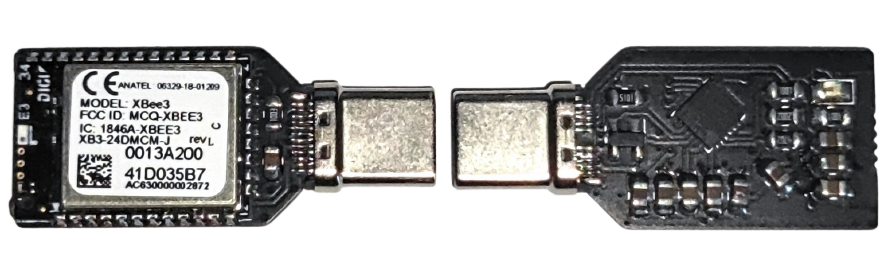

# XBee Dongle

This small USB-C dongle was developed with the objective of obtaining long range, relatively low bitrate communication with a rover or drone, as a way to transmit telemetry data to a computer or smartphone.

For this, a CP2102N USB-to-UART bridge was used. This bridge provides a small internal 100 mA 3.3V voltage regulator, which is used to power a Digi XBee 2.4 GHz communications module with an integrated chip antenna.

